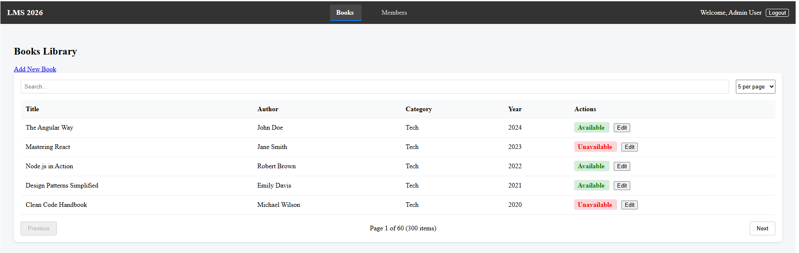
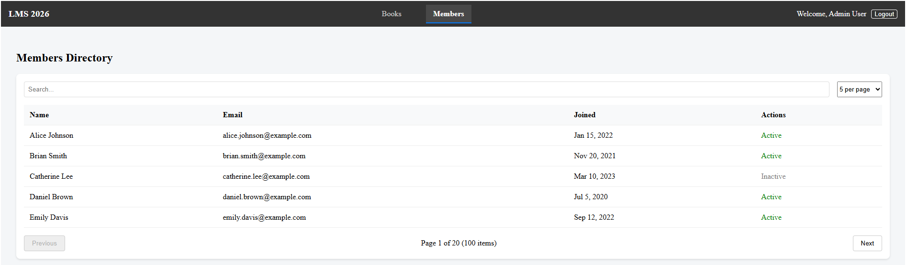

# Library Management System

This project is a Library Management System built to demonstrate the latest features of ```Angular 20```, including Signal-based state management, advanced template control flow, and high-performance rendering strategies.

## Project Objectives
This project serves as a technical demonstration of:
### Reactive State Management:
- Utilizing the Signals API for fine-grained reactivity.
### Performance Optimization:
- Strict enforcement of OnPush change detection.
### Modern Syntax:
- Full implementation of the new Angular control flow (```@if```, ```@for```).
### Clean Architecture:
- Separation of concerns between Core, Features, and Shared layers.

## Access Credentials
To access the protected dashboard, use the following hardcoded credentials:
#### Email: admin@demo.com
#### Password: admin123

## Architecture & Technical Stack
### Signals-First Reactivity
- The application eschews traditional lifecycle-heavy state management in favor of Signals. By using ```signal```, ```computed```, and ```effect```, the application achieves high performance with minimal re-renders.
### State & Data Flow
- Core Service: LibraryService acts as the single source of truth, managing an in-memory collection of books and members with simulated network latency.
- Derived State: Client-side pagination and filtering are handled via computed signals, ensuring that filtered lists are only recalculated when necessary.
### Safe Subscription Patterns
- Memory safety is handled using the modern ```takeUntilDestroyed``` pattern.
```
// Example from BookListComponent
this._bookService.getBooks()
    .pipe(takeUntilDestroyed(this.destroyRef))
    .subscribe({
    next: (books: Book[]) => {
        this.books.set(books);
        this.loading.set(false);
    }
});
```
### Routing & Performance
- Lazy Loading: All feature routes (```/login```, ```/books```, ```/members```) are lazy-loaded to optimize initial bundle size.
- Auth Guard: A functional guard protects internal routes, redirecting unauthenticated traffic to the login screen.

## Project Structure
```
src/app/
├── core/               # Singleton services, Auth Guards, Mock API logic
|   ├── guards          # Auth guards
|   ├── mocks           # Mock the data
|   ├── models          # Model
|   ├── services        # Services
├── features/           # Lazy-loaded feature modules
│   ├── auth/           # Login form and authentication logic
│   ├── books/          # Book list, search, and CRUD forms
│   └── members/        # Read-only member directory
├── shared/             # Reusable UI components, Directives, and Pipes
│   ├── directives/     # Status highlighting directive
│   └── pipes/          # Text truncation pipe
└── app.routes.ts       # Centralized route configuration
```

## Features Breakdown
| Feature | Implementation Detail |
|----------|----------|
| Search/Filter  | Real-time filtering using ```computed``` signals.  |
| Pagination  | Client-side logic with configurable page sizes (5, 10, 20).  |
| Forms  | Reactive Forms with strict validation (e.g., 4-digit year regex).  |
| Custom UI  | ```appStatusHighlight``` directive for indicating unavailable inventory.  |

## Getting Started
### Prerequisites
- Node.js: v20 or higher
- Angular CLI: v20.0.0+

### Installation
- Clone the repository
```
git clone https://github.com/nitishpatankar/library-mgmt-system.git
cd library-mgmt-system
```
### Install Dependencies
```
npm install
```
### Run Development Server
```
ng serve
```
### View the App 
- Navigate to ```http://localhost:4200```

## Screen captures ::
### Book List (Landing page)


### Member List

